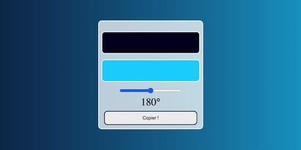

# 

## Auteur


👤 &nbsp; **Thierry LAVAL** [🇫🇷 Contactez moi 🇬🇧](<contact@thierrylaval.dev>)

* Github: [@Thierry Laval](https://github.com/thierry-laval)
* LinkedIn: [@Thierry Laval](https://www.linkedin.com/in/thierry-laval)
* Visitez ==> 🏠 [Site Web](https://thierrylaval.dev)

***

### 📎 Projet 36 - Création d'un Générateur de Dégradés en CSS

_`Début du projet le 27/11/2023`_

***

## Générateur de dégradé



## Description

Le Générateur de dégradé est un outil simple qui vous permet de créer des dégradés personnalisés pour une utilisation dans vos projets de conception graphique. Choisissez facilement vos couleurs de début et de fin, ajustez les paramètres, et copiez le code CSS généré pour intégrer le dégradé dans votre application.

## Fonctionnalités

* Interface utilisateur conviviale
* Personnalisation des couleurs de début et de fin
* Ajustement facile des paramètres de dégradé
* Génération instantanée du code CSS
* Prévisualisation en temps réel du dégradé

## Utilisation

* Ouvrez le fichier index.html dans votre navigateur.
* Utilisez l'interface pour sélectionner les couleurs et ajuster les paramètres.
* Copiez le code CSS généré.
* Intégrez le code dans votre projet.

## Exemple de Code CSS

```css
/* Exemple de code CSS généré par le Gradient Generator */
.element {
background: linear-gradient(to right, #ffcc00, #ff3300);
}
```

### 📦 &nbsp; Utilisé dans ce projet

| Langages        | et Applications    |
| :-------------: |:-------------:     |
| HTML5           | Visual Studio Code |
| CSS3            | JavaScript         |
| Git/GitHub      |                    |

***

#### Contribution

Les contributions sont les bienvenues!

Si vous souhaitez contribuer à ce projet, veuillez suivre les étapes suivantes :

* Fork du projet
* Créez une nouvelle branche (git checkout -b feature/ajout-fonctionnalite)
* Commit de vos modifications (git commit -am 'Ajout d'une nouvelle fonctionnalité')
* Push vers la branche (git push origin feature/ajout-fonctionnalite)
* Ouvrez une Pull Request

#### 📝 &nbsp; License

Copyright © 2023 [Thierry Laval](https://thierrylaval.dev)

Ce projet est sous licence [MIT](LICENCE).

[Voir mon travail](https://github.com/thierry-laval)

[Créer un bon template](https://github.com/thierry-laval/P22-template-pour-un-readme)

***

### &hearts;&nbsp;&nbsp;&nbsp;&nbsp;Love Markdown

Donnez une ⭐️ &nbsp; si ce projet vous a plut !

<span style="font-family:Papyrus; font-size:4em;">FAN DE GITHUB !</span>

<!-- [This is an image](https://myoctocat.com/assets/images/base-octocat.svg) -->

<a href="url"></a>

**[⬆ Retour en haut](#auteur)** <br>
